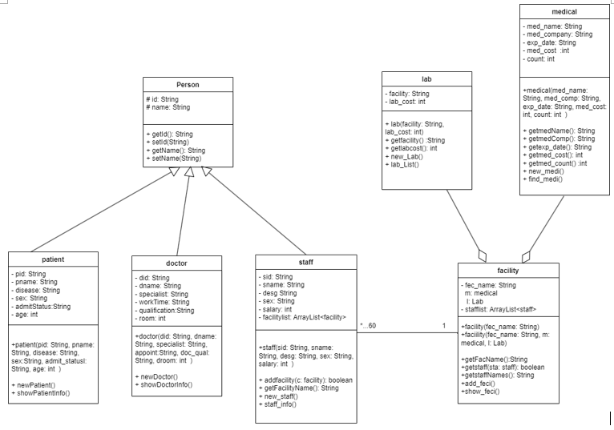

During my studies, my teammate and I developed a Hospital Management System (HMS) in Java using **Eclipse IDE for Java and DSL Developers and Java SE Development Kit 8 (JDK 8 or JDK 1.8 or Java 8)** and object-oriented programming concepts. The main objective of the HMS is to manage activities in a hospital, including patient, doctor, administrative staff, medicine, facility, and laboratory. And thus, this HMS should contain tables for all records of the patient, doctor, administrative staff, medicine, facility, and laboratory. 

